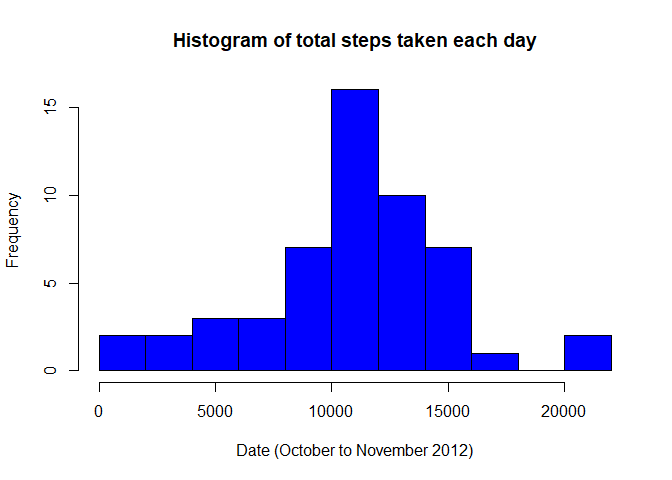
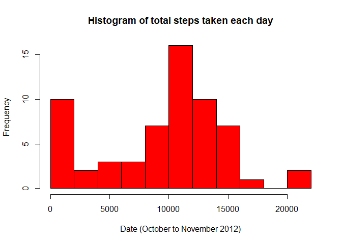
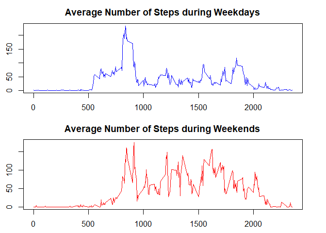

# Activity Monitoring Analysis


### Introduction
It is now possible to collect a large amount of data about personal movement using activity monitoring devices such as a Fitbit, Nike Fuelband, or Jawbone Up. These type of devices are part of the "quantified self" movement - a group of enthusiasts who take measurements about themselves regularly to improve their health, to find patterns in their behavior, or because they are tech geeks. But these data remain under-utilized both because the raw data are hard to obtain and there is a lack of statistical methods and software for processing and interpreting the data.

This assignment makes use of data from a personal activity monitoring device. This device collects data at 5 minute intervals through out the day. The data consists of two months of data from an anonymous individual collected during the months of October and November, 2012 and include the number of steps taken in 5 minute intervals each day.

### Reading in the dataset and processing the data
The data is loaded and the "date" values are changed to the appropriate date format.

```r
data <- read.csv("activity.csv")
data$date = as.Date(data$date, "%Y-%m-%d")
```


### Total number of steps taken each day
Summing up the number of steps for each day and plotting it using a histogram

```r
total_steps <- aggregate(steps ~ date, data, sum)
hist(total_steps$steps, main="Histogram of total steps taken each day", 
     xlab="Date (October to November 2012)", 
     ylab="Frequency",breaks = 10, col = "blue")
```

<!-- -->


### Summary statistics for the total number of steps taken each day

```r
summary(total_steps$steps)
```

```
##    Min. 1st Qu.  Median    Mean 3rd Qu.    Max. 
##      41    8841   10765   10766   13294   21194
```
The mean number of steps taken each day is 10766 and the median number of steps taken each day is 10765

### Time series plot of the average number of steps taken
Averaging the total number of steps for each interval and then visualizing it through a time series plot

```r
mean_steps_interval <- aggregate(steps ~ interval, data, mean)
plot(mean_steps_interval$interval, mean_steps_interval$steps, 
     main="Time Series Plot of average steps taken each day", 
     xlab="Date (October to November 2012)", 
     ylab="Average", type="l", lwd=1)
```

<!-- -->


### The 5-minute interval that, on average, contains the maximum number of steps

```r
max_index <- which(mean_steps_interval$steps == max(mean_steps_interval$steps))
mean_steps_interval[max_index,1]
```

```
## [1] 835
```
The 835th interval contains the maximum number of steps

### Method for imputing missing data
First, the average number of steps of each day is calculated. Next, NA values corresponding to a particular day are replaced by its averaged value. If all the values for a particular day are NA, then the average step for that is zero.

```r
mean_steps <- aggregate(steps ~ date, data, mean)
edited_data <- data
for (i in 1:nrow(data)) {
  
  if (is.na(data[i,1])==TRUE) {
    if (any(mean_steps$date==data[i,2]) == TRUE) {
      
      ind <- which(mean_steps$date == data[i,2])
      edited_data[i,1] <- mean_steps[ind,2]
      
    } else {
      edited_data[i,1] <- 0
    }
  }
}
```


### Total number of steps taken each day after missing values are imputed

```r
new_total_steps <- aggregate(steps ~ date, edited_data, sum)
hist(new_total_steps$steps, main="Histogram of total steps taken each day", 
     xlab="Date (October to November 2012)", 
     ylab="Frequency",breaks = 10, col = "red")
```

<!-- -->

```r
summary(new_total_steps$steps)
```

```
##    Min. 1st Qu.  Median    Mean 3rd Qu.    Max. 
##       0    6778   10395    9354   12811   21194
```
The mean number of steps taken each day is 9354 and the median number of steps taken each day is 10395

### Panel plot comparing the average number of steps taken per 5-minute interval across weekdays and weekends

```r
days_data <- data
days_data$date <- as.character(weekdays(data$date))
weekday_data <- subset(days_data, (days_data$date == "Monday" | 
                                     days_data$date == "Tuesday" |
                                     days_data$date == "Wednesday" |
                                     days_data$date == "Thursday" |
                                     days_data$date == "Friday"))

weekend_data <- subset(days_data, (days_data$date == "Saturday" | 
                                     days_data$date == "Sunday"))

weekday_steps_interval <- aggregate(steps ~ interval, weekday_data, mean)

weekend_steps_interval <- aggregate(steps ~ interval, weekend_data, mean)

par(mfrow=c(2,1), mai = c(0.5, 0.5, 0.5, 0.5))
plot(weekday_steps_interval$interval, weekday_steps_interval$steps, type = "l", 
     main = "Average Number of Steps during Weekdays", 
     xlab = "Interval", ylab = "Frequency", col = "blue")
plot(weekend_steps_interval$interval, weekend_steps_interval$steps, type = "l", 
     main = "Average Number of Steps during Weekends", 
     xlab = "Interval", ylab = "Frequency", col = "red")
```

<!-- -->
